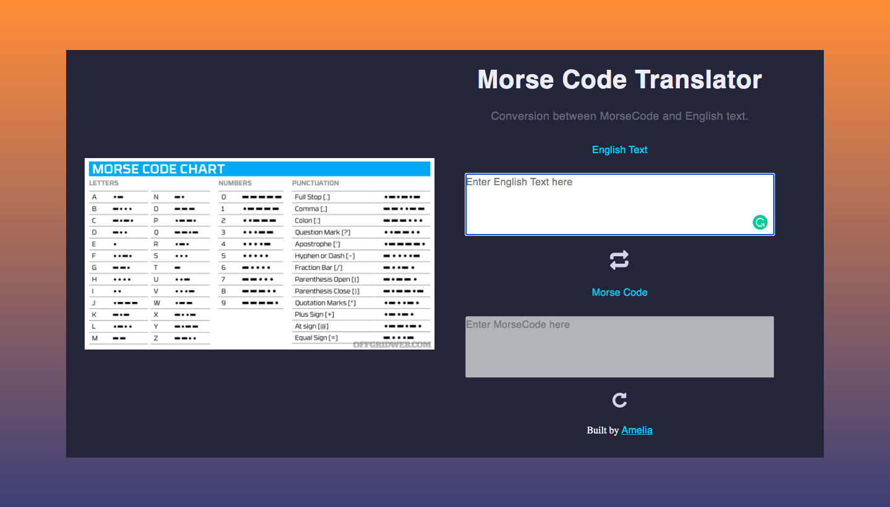

# Morse Code Translator

## Aim

A project that converts English text into Morse Code and the other way around using HTML, JavaScript, CSS/SCCS.

## Goals

-   Implementation of EventListeners, Array methods and iterators, DOM Interactions and knowledge of manipulating complex data and objects.

## Live Site

https://amx3.github.io/Morse-Code-Translator/

## MVP

1.  Create a user interface that allows the user to either input some English text or some Morse Code.
2.  Create JS functions that would allow the user to translate their English text into Morse Code or Morse Code into English text.
3.  Make sure to handle spaces properly (ie. there is 1 space between English words, but one space between Morse Code characters).

## Implementation Process

1. Select HTML elements, such as input boxes, using the DOM and assigning them to a variable.

2. Using an icon that allows the user to switch between English and Morse Code typing. When the page loads, the effect is applied.

3. A Morse Code dictionary's global variable is maintained as an object containing key value pairs.

4. An icon that allows the user to reset all input fields is used.

5. Created two functions that are each attached to seperate eventListeners.
    - English to Morse Code conversion
    - Morse Code to English Code conversion

### English To Morse Code Conversion

-   Reversing key and value and putting it in a new object using the global variable
-   To match our keys, english input value has been changed to lowercase
-   Replaced the space in english words with a / using regex
-   Split each word into distinct letters and returned the corresponding morsecode depending on its matching key
-   Joined the letters together to form a single word
-   Joined the words together with a / as seen in Morse Code behaviour

### Morse Code to English Conversion

**Note:** There is a space between each letter represented by a morse dot/dash.

-   Splitting the morse code word by its /
-   Map through each morsecodeword, trim leading spaces before and after the word and then split the word into each individual morsecode letter
-   Map through each letter and return the matching alphabet/num/punctuation based on its key
-   If letter is empty return an empty string otherwise if the morsecode input does not register a similar key, the value will return as "X"
-   Join the letters together, then the words together

<!-- ## Resources Used

-   uiGradients - Beautiful colored gradients at https://uigradients.com

-   Icons: https://freeicons.io/ -->
